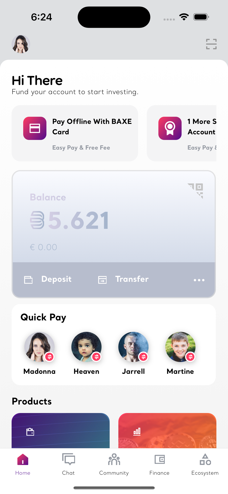
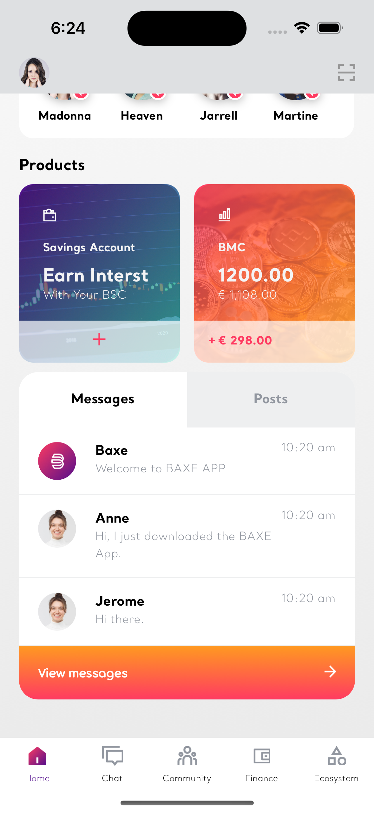

# Baxe Code Challenge

This repo contains a code-challenge for Baxe (baxe.com). Baxe is a lifestyle app that is everything you love about the Internet - with the security of blockchain technology

## How to run the App

The prerequisites for running the App properly are described in the RN official documentation, check the [Official guide](https://reactnative.dev/docs/getting-started) to get started with React Native.

With the setup completed, from a terminal instance, run the following commands to run on iOS (macOS).

```bash
~ yarn install && npx pod-install
~ npx react-native run-ios
```

## About

This App is a code-challenge that has the objective of taking the [Figma designs](https://www.figma.com/file/EhDxvOBVUlFWEbhS3lwx8l/Home-Test) and translating them into a react-native App in the most accurate way possible. 

In order to do so, I developed a mostly functional react-native ejected App which features it's own navigation and Screens. The folders are organized in the following way in which 

- assets (like fonts) are available on the `src/assets` folder. 
- reusable components are available from the root `src/components` folder. 
- config assets, constants and global types are stored in the `src/config` folder
- the context provider for Contacts is stored in the `src/context` folder
- navigators, such as the main Bottom Tab Navigation, is on `src/navigators` folder.
- screens (just one for this challenge) are located on `src/screens`.

Ad-hoc components for each screen live inside their own custom `my-component/components` folders, including all of it's assets, components, assets, images, etc.

To make the challenge a bit more dynamic, It's using faker API to fetch contacts and populating the `Quick Pay` component with actual data.

## Screenshots


<div style="display: flex; flex-direction: 'column';">
	
	
	
</div>
